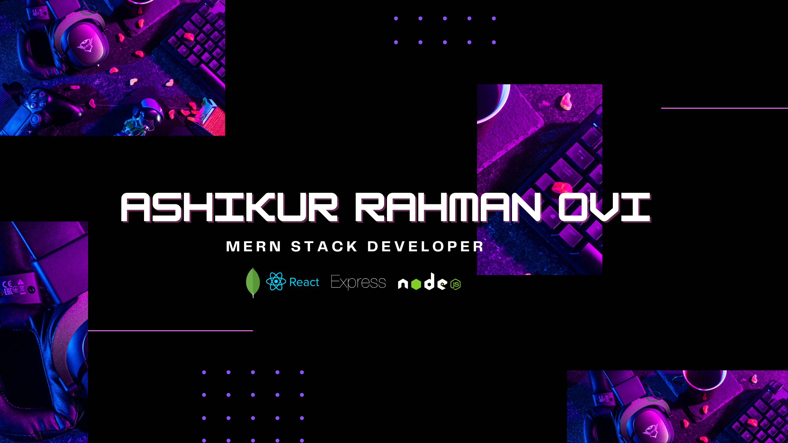

### Hi there 👋

## :chart_with_upwards_trend: Current Stats

##  💫 About Me 

 Versatile MERN Stack Developer | Proficient in HTML, CSS, Tailwind CSS,
React, and JavaScript for Frontend | Comfortable with Backend Technologies:
Node.js, Express.js, MongoDB | Experienced in Firebase for Deployment |
 Eager to Contribute and Learn in a Dynamic Development Environment

 ## 💻 Tech Stack:

                     

## 🕹️ Current Overview

- 🌱 I’m currently learning **Next Js, MUI**

- 👯 I’m looking to collaborate on **Frontend Projects**

- 💬 Let's talk about **React, Node Js, Tailwind CSS, Daisy UI**

- 📧 How to reach me **ashikurovi2003@gmail.com.com**

 ## 🚀 Latest Projects

 ### Ruby Medical Camp  💊

 <ul>
  <li><strong>Description:</strong> This is a medical camp management website.  This website has roles of all three.  Here participants can join different camps.  Can register for upcoming Camps.Organizers can add new Camps from their dashboard.  And he can manage them </li>
  <li><strong>Technology used:</strong> React.js, JavaScript, Tailwind CSS, Daisy UI, Express.js, MongoDB, and Firebase Stripe.</li>
  <li>
    <a href="https://github.com/ashikurbd71/Ruby-Medical-Camp-Client">Client side</a> | <a href="https://github.com/ashikurbd71/Ruby-Medical-Camp-Server">Server side</a> | <a href="https://ruby-medical-camps.surge.sh">Live site link</a>
  </li>
</ul>

 ###  Squarespace 📝

  <ul>
  <li><strong>Description:</strong>  This is a blog website.  Here the user can read the blogs.  Available Blogs can be viewed in Available Blog Station and can be sorted and filtered according to the name of the blog as desired.  And user can update and manage blogs post by visiting his dashboard</li>
  <li><strong>Technology used:</strong> React.js, JavaScript, Tailwind CSS, Daisy UI, Express.js, MongoDB, and Firebase </li>
  <li>
    <a href="https://github.com/ashikurbd71/Blog-Client-Side">Client side</a> | <a href="https://github.com/ashikurbd71/Blog-Server-Side">Server side</a> | <a href="https://phsquarespace.surge.sh">Live site link</a>
  </li>
</ul>

###  Bd-Shop 🏕️

  <ul>
  <li><strong>Description:</strong>  This is a Simple e-commerce website.  Here the products of various brands have been shown.  Different brands can add their products.  And he can delete and update them later.  Users can see the products of their choice.  You can buy it at will.  The products he buys will be added to the add to card section.</li>
  <li><strong>Technology used:</strong> React.js, JavaScript, Tailwind CSS, Daisy UI, Express.js, MongoDB, and Firebase </li>
  <li>
    <a href="https://github.com/ashikurbd71/Brand-Shop-Client">Client side</a> | <a href="https://github.com/ashikurbd71/Brand-Shop-Server">Server side</a> | <a href="https://bd-committee.surge.sh">Live site link</a>
  </li>
</ul>

## :mailbox: Reach me out

   

.

 

## :eyes: Github Summary
 

  

 

  
  

 

